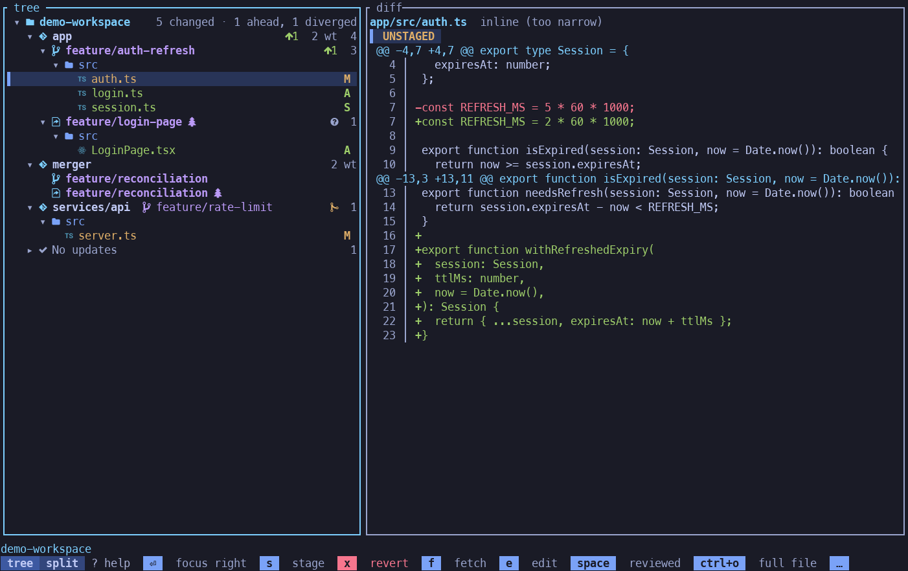
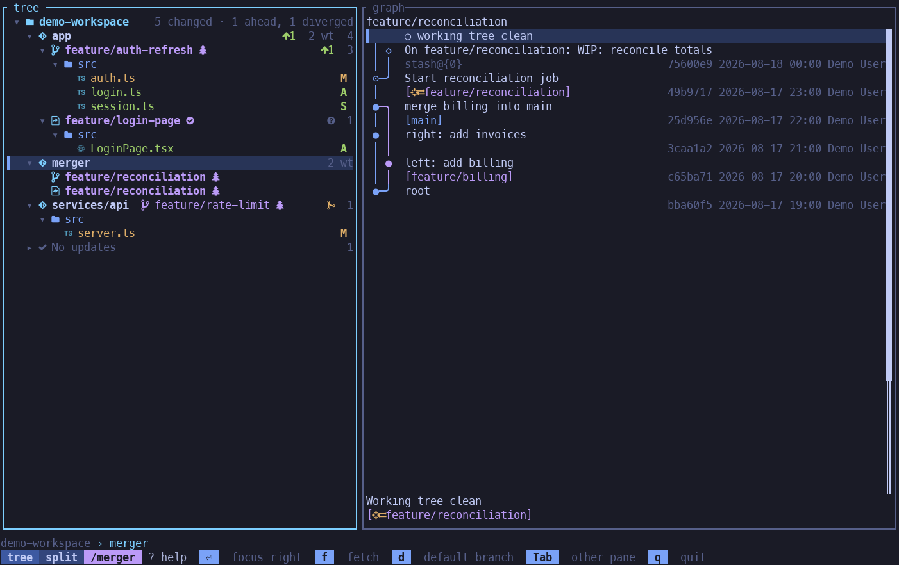
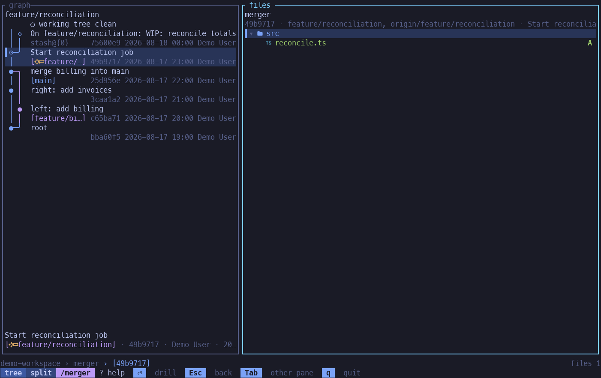
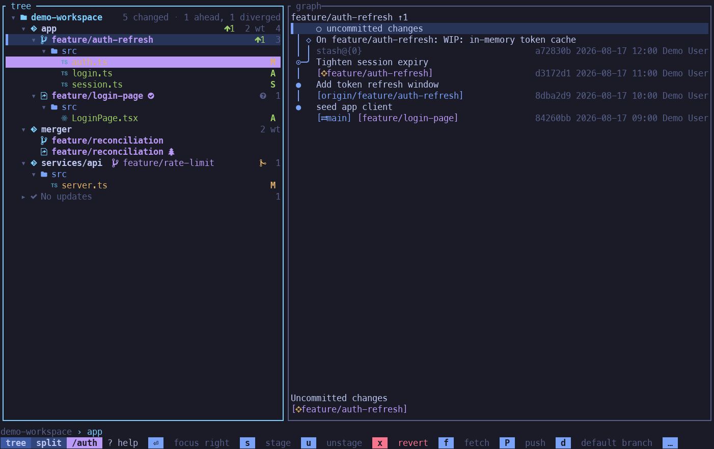
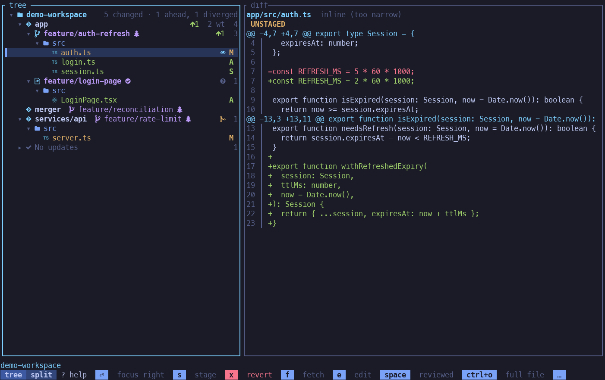
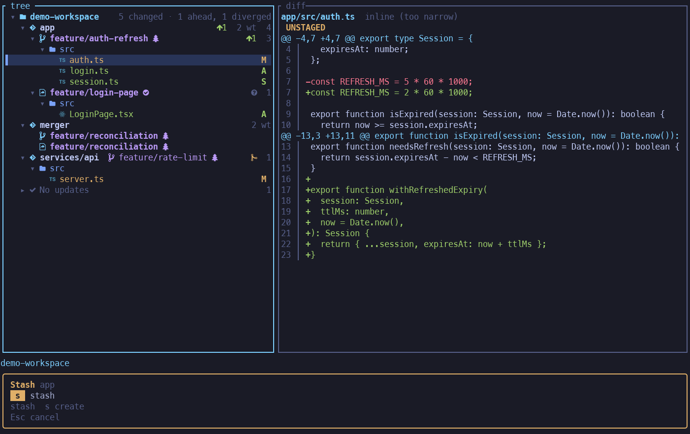
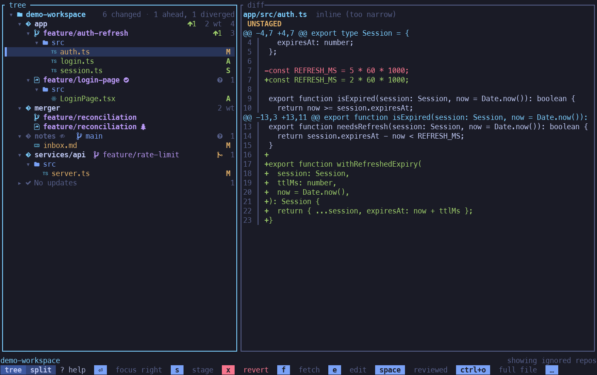
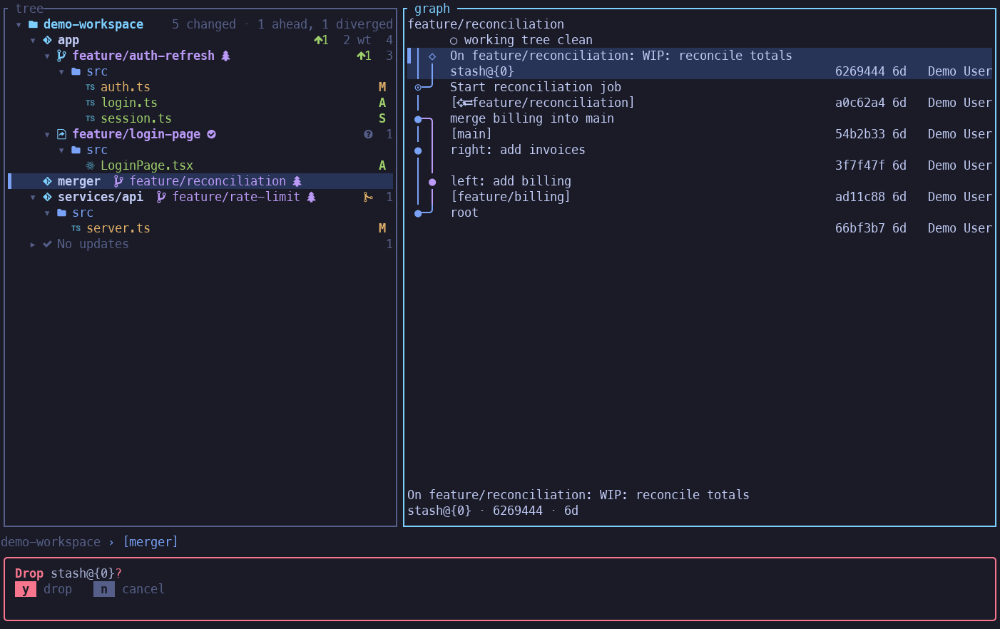
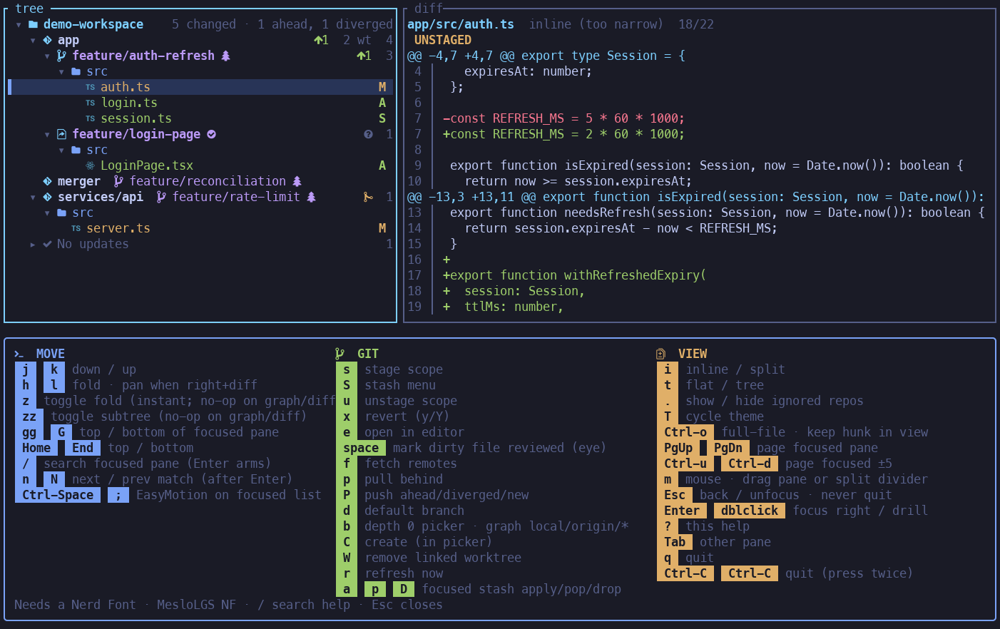

# workspace-status

Git status for every repo and worktree under the current directory, in one TUI.

Cursor and VS Code's source control pane is fine for one repo. It falls apart once you have a folder full of them. Worktrees make that worse: same project, three checkouts, three half-finished agent branches, and the SCM view is just a pile of files with no sense of which tree you are in.

This is the glance I wanted instead. Left pane is the workspace tree (repos, worktrees, dirty files). Right pane is the graph, the diff, or the commit. Fetch, pull, checkout, stash, search, mark files reviewed — without opening each folder in the IDE.

`ws` on a TTY opens that. `--plain` and `--json` print the same snapshot if an agent is calling it.

## Screenshots

**File diff** — dirty `auth.ts` and its unified diff.



**Git graph** — commits, joins, and the stash diamond `◇`.



**Commit files** — Enter a commit; the files that landed in it.



**Search** — `/auth` Enter. Matches highlight; rows stay visible.



**Reviewed** — Space on a dirty file. Eye `` sits before the status badge.



**Stash** — `S` on a dirty repo. Create from the tree.



**Ignored** — `.` brings `notes` into the tree (`ignoredRepos`).



**Confirm** — drop a stash (`D`). `y` / `n` in a boxed overlay.



**Help** — `?` opens MOVE / GIT / VIEW.



Rebuild these frames with `./scripts/capture-demo-stills.sh` (see [docs/demo.md](./docs/demo.md)).

## Install

### GitHub Release

Installs `workspace-status`, `ws`, and `workspace-status-update` into `~/.local/bin` (already on PATH for Ubuntu login shells). The installer cannot mutate the parent shell PATH, so export it and `hash -r` in the same session:

```bash
curl -LsSf https://github.com/joboyx/my-workspace-status/releases/latest/download/workspace-status-installer.sh | sh
export PATH="$HOME/.local/bin:$PATH" && hash -r
```

Update that install with `ws --update` (same as `workspace-status --update`). That prints GitHub Release notes for versions newer than the installed binary, then runs `workspace-status-update`. The installer also places that sidecar next to the binaries. On a TTY, `ws` also checks GitHub Releases at most every 6 hours and asks `new version available, update? [y/n]` before the TUI if a newer release exists. `--plain` and `--json` skip that check.

Windows:

```powershell
irm https://github.com/joboyx/my-workspace-status/releases/latest/download/workspace-status-installer.ps1 | iex
```

Uninstall:

```bash
./scripts/uninstall.sh
```

That removes `~/.local/bin/{ws,workspace-status,workspace-status-update}` (and a leftover `~/.cargo/bin` copy) and the cargo-dist receipt under `${XDG_CONFIG_HOME:-$HOME/.config}/workspace-status/`.

### From source

Requires rustc 1.85 or later. This repository is a Cargo workspace. Name the package when you install from git:

    cargo install --git https://github.com/joboyx/my-workspace-status --locked --package workspace-status

From a local clone:

    cargo install --path crates/workspace-status --locked

## Agents

On a TTY, `ws` without `--plain` or `--json` opens the TUI and waits for keys. That hang is the TUI, not a crash. Agents must pass `--plain` or `--json` on every run. Do not rely on a non-TTY stdin.

`--plain` is the human text of the workspace snapshot. `--json` is the same snapshot as JSON. See [docs/snapshot.md](./docs/snapshot.md).

## Nerd Font

The TUI expects a Nerd Font. Use MesloLGS NF (romkatv/powerlevel10k-media).
MesloLGM Nerd Font Mono letter-spaces in some VTE terminals (xfce4-terminal sizes cells off the widest Nerd glyph).
Set WS_STATUS_GLYPHS=ascii for plain markers.

## Workspace config

`workspace-status` reads `.workspace-status-config.json` from the current workspace root.

```json
{
  "ignoredRepos": ["notes"],
  "maxDepth": 3,
  "defaultBranches": {
    "services/api": "develop"
  },
  "editor": "vim"
}
```

- `ignoredRepos` — skip those repos from discovery, status checks, fetch, pull, and default-branch switching
- `maxDepth` — how many path segments below cwd to search for git repos (default **3**, so `group/app/module` is included)
- `defaultBranches` — optional map of workspace-relative repo path → sole default branch. When set, that branch is used for classification, markers, ordering, and `--default-branch` / TUI `d`. When omitted for a repo, behaviour matches today (classification: `main`/`master`/`develop`; switch target from git).
- `editor` — optional command for TUI `e` (same shape as `$EDITOR`). Omit the key or set `"editor": "vim"` for vim (the default). `"editor": "cursor"` opens Cursor IDE. Overrides `$EDITOR` / `$VISUAL`.

Pass `-a` or `--all` to include repos listed in `ignoredRepos` for that run (`maxDepth` is unchanged). In the TUI, `.` shows or hides those repos at runtime (starts shown with `-a`, hidden without it). Hidden ignored repos stay out of workspace operations unless you show them.

Pass one or more repo paths to limit output (e.g. `ws app vendor-docs`). Named repos are included even when listed in `ignoredRepos`. Named filters may also target linked paths under `.worktrees/` (same discovery as a full collect).

## Plain report markers

- **Files** column — dirty/clean working tree (`💾` / `📝` / `✨` / `⚠️`), not “linked worktree”
- **🔗** — linked git worktree checkout (repo path prefix + `🔗 Linked worktrees` summary)
- **✅** / **🌱** after a non-default branch — tip merged into default / still open

## Interactive TUI

On a TTY (without `-v` / `-p` / `-d` / `--plain` / `--json`), `ws` opens the TUI and waits for keys.
`-i` / `--tui` forces the TUI when stdout is not a TTY. Those headless flags still win over `--tui`.
A non-TTY run without those flags prints `--plain`.

The TUI uses the terminal **alternate screen** (DEC 1049, same idea as Vim/less) while running, so frames do not remain in primary scrollback after a normal exit. Before `$EDITOR` (`e`) it leaves that buffer and re-enters on return. `SIGKILL` skips that restore.

Requirements, keymap, and layout details: [docs/configuration.md](./docs/configuration.md).

Known limits: intra-line word diff is not in this TUI yet; macOS PageUp needs the terminal to deliver the key (`Fn+Up` / mapped PageUp); search `/` is armed with Enter before `n` / `N` step matches.

Several graph features — including checkout confirm when a local branch is out of sync with `origin/*` — are inspired by [Git Graph](https://github.com/mhutchie/vscode-git-graph) (mhutchie, VS Code).

## Contributing

See [CONTRIBUTING.md](./CONTRIBUTING.md). Local checks are `cargo test --workspace`.

## Development

The CLI is treated as a black box:

- the output format is the user-facing contract
- behaviour is exercised against real temporary git repositories
- task-branch behaviour is validated with real remotes, not mocked helpers

### Reference contract

- Desired output shapes live in [SAMPLE_OUTPUT.md](./SAMPLE_OUTPUT.md).
- The workspace snapshot contract (`--json` and `--plain`) lives in [docs/snapshot.md](./docs/snapshot.md).
- The snapshot fixture e2e lives in [crates/workspace-status/tests/snapshot_contract.rs](./crates/workspace-status/tests/snapshot_contract.rs).
- Headless TUI coverage lives in [crates/workspace-status/tests/tui_headless_e2e.rs](./crates/workspace-status/tests/tui_headless_e2e.rs).
- Real-TTY TUI e2e lives in [crates/workspace-status/tests/tui_tty_e2e/](./crates/workspace-status/tests/tui_tty_e2e/). See [docs/tui-tty-e2e.md](./docs/tui-tty-e2e.md).

### Running the test suite

```bash
cargo test --workspace
```

Agent map of TestBackend vs PTY vs desktop `#[ignore]`, plus `WS_STATUS_UPDATE_CHECK_STORE`: [AGENTS.md](./AGENTS.md).

### Coverage

`cargo test --workspace` covers the snapshot contract, CLI flags, discovery, the headless TUI path (TestBackend, no TTY), and the real-TTY TUI path (PTY, Unix):

| Area                  | Covered behavior                                                                                                                                                                                |
| --------------------- | ----------------------------------------------------------------------------------------------------------------------------------------------------------------------------------------------- |
| Real-TTY TUI e2e      | PTY spawn of the binary; live `event::read`. Operator writes (review, stage, fetch/pull/push on a local origin, graph merge commit, full stash) plus tree hscroll (clipped prefix vs `TAIL99`). xfce keys + xterm XTEST wheel in Actions `tui-tty-desktop` ([docs/tui-tty-e2e.md](./docs/tui-tty-e2e.md)) |
| CLI contract          | `--help` documents `--all`, `--fetch`, `--verbose`, `--pull`, `--default-branch`, `--plain`, `--json`, and `--update` |
| Snapshot contract     | `--json` and `--plain` share one workspace snapshot; fixture e2e builds a temp workspace and asserts both without a TTY                                                                         |
| Clean summary         | all-clean default-branch workspaces and mixed clean default/non-default workspaces                                                                                                              |
| Verbose table         | category ordering, default/non-default grouping, `no-upstream` display, detached HEAD display, and mixed-state table output                                                                     |
| File changes          | unstaged-only, untracked-only, staged-only, staged+unstaged, staged+unstaged+untracked, rename, delete, and ticket-aware repo labels                                                            |
| Sync states           | behind-only, ahead-only, diverged-only, and combined sync summaries with branch names and ticket IDs                                                                                            |
| Branch summaries      | clean non-default branch summaries (feature, bugfix, chore, release, unknown) with ticket or `[branch]` labels                                                                                  |
| Combined snapshot     | one end-to-end scenario exercising file changes, sync states, branches, and verbose ordering together                                                                                           |
| Fetch                 | `--fetch` refreshes remote tracking state before status is computed and before the verbose table is rendered                                                                                    |
| Pull                  | `--pull` updates behind repos (auto-stash dirty worktrees) and refreshes the final summary                                                                                                      |
| Default branch switch | `--default-branch` switches clean non-default branches back to default and skips dirty repos                                                                                                    |
| Symlinked / gitfile   | Symlinked directories and repos with a `.git` file (linked worktrees / some submodules) are discovered like regular repos                                                                       |
| Linked worktrees      | `git worktree list` paths under cwd appear with `🔗`; Files column = dirty/clean; `✅`/`🌱` merge marks; named filters accept `.worktrees/` paths                                               |
| Workspace config      | `ignoredRepos` skips configured repos; `maxDepth` (default 3) caps discovery depth; `defaultBranches` overrides per-repo default; `editor` sets TUI `e` command; `--all` includes ignored repos |
| Repo filter           | Positional repo paths limit output to named repos; named repos bypass `ignoredRepos`; unknown repos exit with an error                                                                          |

### Scenario isolation

Each test scenario:

- creates a fresh temp workspace
- creates fresh bare remotes and collaborator clones when needed
- reinitializes git state from scratch
- destroys the scenario after the assertion run

That isolation is deliberate. Refactors should be able to change implementation details while preserving the observable contract.

## Documentation

| Document | Contents |
| --- | --- |
| [docs/architecture.md](./docs/architecture.md) | Module map, data flow, where to add new behaviour |
| [docs/snapshot.md](./docs/snapshot.md) | Workspace snapshot contract for `--plain`, `--json`, and the TUI |
| [docs/tui-model.md](./docs/tui-model.md) | Tree model, row kinds, session state, action registry |
| [docs/git-graph-topology.md](./docs/git-graph-topology.md) | Graph gutter glyphs, junctions, densify rails, stash leaf tips |
| [docs/graph.md](./docs/graph.md) | Ratatui workspace-status-graph widget contract |
| [docs/diff-rendering.md](./docs/diff-rendering.md) | Diff pipeline and syntax highlighting |
| [docs/git-operations.md](./docs/git-operations.md) | Git commands, operation semantics, safety rules |
| [docs/demo.md](./docs/demo.md) | Demo workspace and screenshot frames |
| [docs/tui-rust.md](./docs/tui-rust.md) | Ratatui TUI keys, layout, and chrome |
| [docs/tui-tty-e2e.md](./docs/tui-tty-e2e.md) | Real-TTY TUI e2e (PTY in CI, desktop TTY job: xfce keys + xterm XTEST wheel) |
| [docs/configuration.md](./docs/configuration.md) | Environment variables, workspace config, keymap |

## License

Apache License 2.0. See [LICENSE](./LICENSE).
