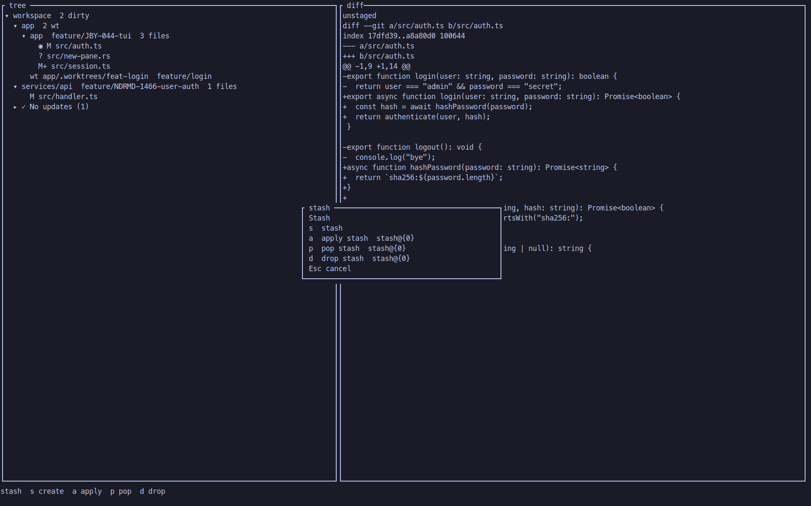
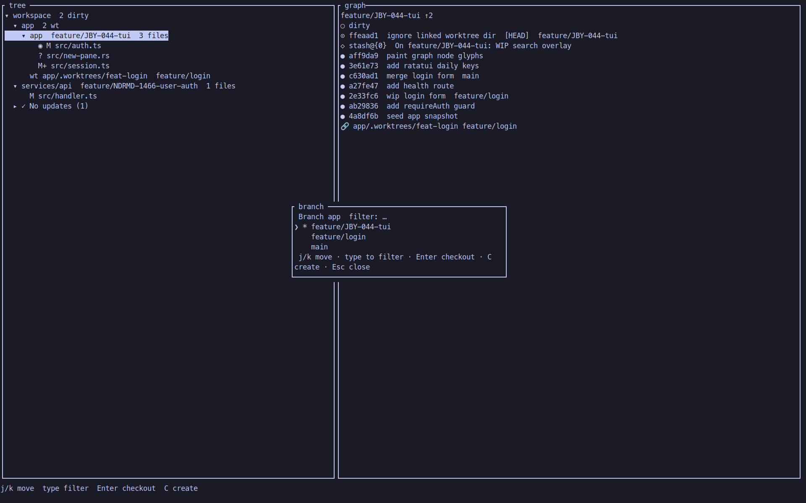
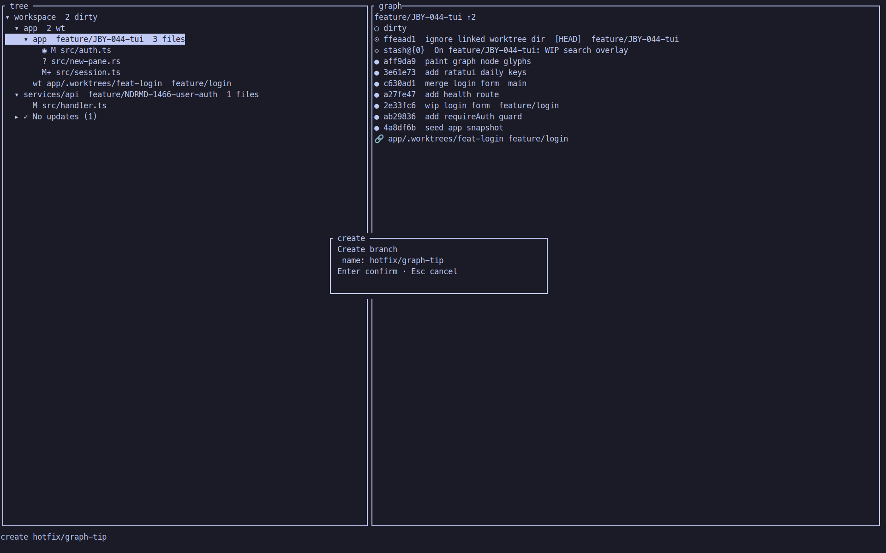
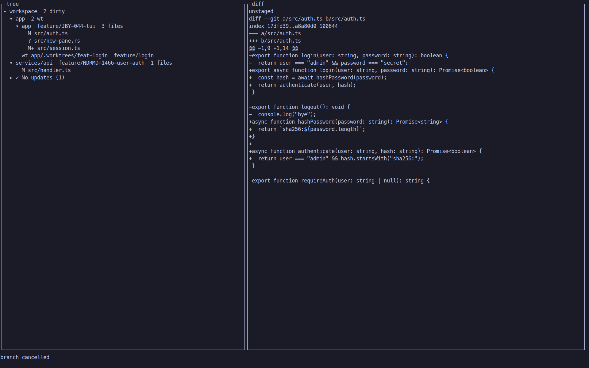
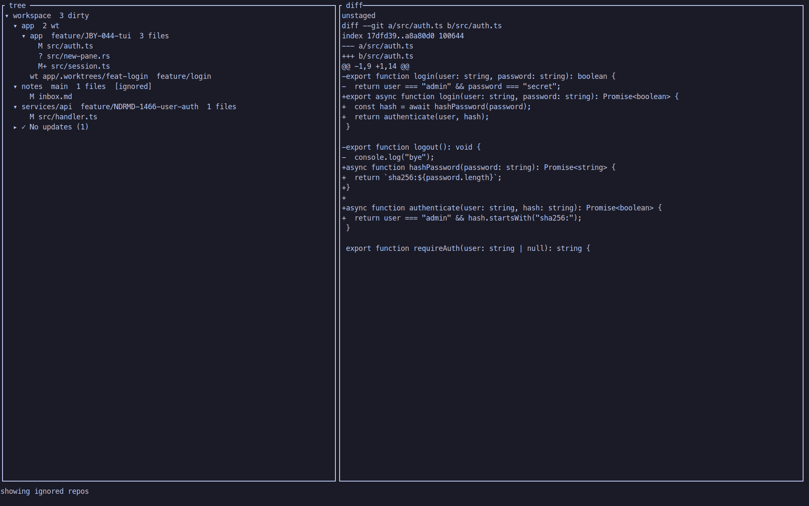

# workspace-status

`workspace-status.sh` is the workspace-level git status contract for this tool.
The implementation is TypeScript under `src/` (`src/index.ts` → `dist/index.js`); git subprocesses use [`zx`](https://google.github.io/zx/) `$` (run via Node, not the zx CLI). The `.sh` launcher runs `npm ci` and `npm run build` when needed.

`crates/workspace-status` is the Rust CLI (`workspace-status` and `ws`).
On a TTY it opens a ratatui TUI. `--plain` and `--json` print the same snapshot.
`crates/workspace-status-graph` is the ratatui git-graph widget used by that TUI.
The TypeScript Ink app is still in this repository for features the Rust TUI does not cover yet. See [docs/tui-rust.md](./docs/tui-rust.md).

It is intentionally treated as a black-box CLI:

- the output format is the user-facing contract
- the script is exercised against real temporary git repositories
- task-branch behavior is validated with real remotes, not mocked helpers

## Install

Requires Node 20 or later, npm, and git. The Rust crates need rustc 1.85 or later.

### TypeScript app (TUI + current ws wrapper)

Clone this repository, then install and link commands:

```bash
git clone https://github.com/joboyx/my-workspace-status.git
cd my-workspace-status
npm ci
npm link
```

`npm link` installs two commands: `workspace-status` and `ws`. They launch the TypeScript app.

The launcher also installs dependencies and builds dist when they are missing or stale.

### Rust CLI (TUI + --plain / --json)

This repository is a Cargo workspace. Name the package when you install from git:

    cargo install --git https://github.com/joboyx/my-workspace-status --locked --package workspace-status

From a local clone:

    cargo install --path crates/workspace-status --locked

Both commands install workspace-status and ws into Cargo bin.
On a TTY the Rust binary opens the ratatui TUI. Pass --plain or --json for agents.
`-i` / `--tui` forces the TUI when stdout is not a TTY. `-v` / `-p` / `-d` / `--plain` / `--json` still stay headless.
A non-TTY run without those flags prints --plain.
The TypeScript app stays available for Ink-only features.

## Use --plain or --json from agents

On a TTY, the TypeScript app without --plain or --json opens the interactive TUI and waits for keyboard input.
That hang is the TUI, not a crash.
Agents must pass --plain or --json on every run. Do not rely on a non-TTY stdin.

The Rust CLI opens the TUI on a TTY. A non-TTY run without those flags prints the --plain report.

`--plain` is the human text of the workspace snapshot.
`--json` prints the same snapshot as JSON. See [docs/snapshot.md](./docs/snapshot.md).

## Nerd Font

The TUI expects a Nerd Font. Use MesloLGM Nerd Font Mono (the Mono build).
The proportional build breaks column alignment.
Set WS_STATUS_GLYPHS=ascii to use plain markers.

## Reference contract

- Desired output shapes live in [SAMPLE_OUTPUT.md](./SAMPLE_OUTPUT.md).
- The workspace snapshot contract (`--json` and `--plain`) lives in [docs/snapshot.md](./docs/snapshot.md).
- The executable end-to-end suite lives in [test/workspace-status.e2e.ts](./test/workspace-status.e2e.ts).
- The snapshot fixture e2e lives in [test/snapshot-contract.e2e.ts](./test/snapshot-contract.e2e.ts).

## Workspace config

`workspace-status.sh` reads `.workspace-status-config.json` from the current workspace root.

```json
{
  "ignoredRepos": ["notes"],
  "maxDepth": 3,
  "defaultBranches": {
    "services/api": "develop"
  },
  "editor": "vim"
}
```

- `ignoredRepos` — skip those repos from discovery, status checks, fetch, pull, and default-branch switching
- `maxDepth` — how many path segments below cwd to search for git repos (default **3**, so `group/app/module` is included)
- `defaultBranches` — optional map of workspace-relative repo path → sole default branch. When set, that branch is used for classification, markers, ordering, and `--default-branch` / TUI `d`. When omitted for a repo, behaviour matches today (classification: `main`/`master`/`develop`; switch target from git).
- `editor` — optional command for TUI `e` (same shape as `$EDITOR`). Omit the key or set `"editor": "vim"` for vim (the default). `"editor": "cursor"` opens Cursor IDE. Overrides `$EDITOR` / `$VISUAL`.

Pass `-a` or `--all` to include repos listed in `ignoredRepos` for that run (`maxDepth` is unchanged). In the TUI, `.` shows or hides those repos at runtime (starts shown with `-a`, hidden without it). Hidden ignored repos stay out of workspace operations unless you show them.

Pass one or more repo paths to limit output (e.g. `workspace-status.sh app vendor-docs`). Named repos are included even when listed in `ignoredRepos`. Named filters may also target linked paths under `.worktrees/` (same discovery as a full collect).

## Plain report markers

- **Files** column — dirty/clean working tree (`💾` / `📝` / `✨` / `⚠️`), not “linked worktree”
- **🔗** — linked git worktree checkout (repo path prefix + `🔗 Linked worktrees` summary)
- **✅** / **🌱** after a non-default branch — tip merged into default / still open

## Setup

`workspace-status.sh` runs `npm ci` when `node_modules` is missing/stale vs `package-lock.json` (via npm’s `node_modules/.package-lock.json` marker), and `npm run build` when `dist/index.js` is missing or older than `src/**/*.{ts,tsx}` or `tsconfig.json`. For local development, `npm ci` in this directory is still fine.

## Running the E2E suite

```bash
npm test
cargo test
```

Optional environment variables:

- `WORKSPACE_STATUS_SCRIPT=/abs/path/to/workspace-status.sh` tests a different script path.
- `KEEP_E2E_WORKDIR=1` keeps each temp scenario on disk for debugging.

## Coverage

The E2E suite covers the full sample-scenario surface plus the main operational flags of `workspace-status.sh`:

| Area                  | Covered behavior                                                                                                                                                                                |
| --------------------- | ----------------------------------------------------------------------------------------------------------------------------------------------------------------------------------------------- |
| CLI contract          | `--help` documents `--all`, `--fetch`, `--verbose`, `--pull`, `--default-branch`, `--plain`, and `--json`                                                                                       |
| Snapshot contract     | `--json` and `--plain` share one workspace snapshot; fixture e2e builds a temp workspace and asserts both without a TTY                                                                         |
| Clean summary         | all-clean default-branch workspaces and mixed clean default/non-default workspaces                                                                                                              |
| Verbose table         | category ordering, default/non-default grouping, `no-upstream` display, detached HEAD display, and mixed-state table output                                                                     |
| File changes          | unstaged-only, untracked-only, staged-only, staged+unstaged, staged+unstaged+untracked, rename, delete, and ticket-aware repo labels                                                            |
| Sync states           | behind-only, ahead-only, diverged-only, and combined sync summaries with branch names and ticket IDs                                                                                            |
| Branch summaries      | clean non-default branch summaries (feature, bugfix, chore, release, unknown) with ticket or `[branch]` labels                                                                                  |
| Combined snapshot     | one end-to-end scenario exercising file changes, sync states, branches, and verbose ordering together                                                                                           |
| Fetch                 | `--fetch` refreshes remote tracking state before status is computed and before the verbose table is rendered                                                                                    |
| Pull                  | `--pull` updates behind repos (auto-stash dirty worktrees) and refreshes the final summary                                                                                                      |
| Default branch switch | `--default-branch` switches clean non-default branches back to default and skips dirty repos                                                                                                    |
| Symlinked / gitfile   | Symlinked directories and repos with a `.git` file (linked worktrees / some submodules) are discovered like regular repos                                                                       |
| Linked worktrees      | `git worktree list` paths under cwd appear with `🔗`; Files column = dirty/clean; `✅`/`🌱` merge marks; named filters accept `.worktrees/` paths                                               |
| Workspace config      | `ignoredRepos` skips configured repos; `maxDepth` (default 3) caps discovery depth; `defaultBranches` overrides per-repo default; `editor` sets TUI `e` command; `--all` includes ignored repos |
| Repo filter           | Positional repo paths limit output to named repos; named repos bypass `ignoredRepos`; unknown repos exit with an error                                                                          |

## Scenario isolation

Each test scenario:

- creates a fresh temp workspace
- creates fresh bare remotes and collaborator clones when needed
- reinitializes git state from scratch
- destroys the scenario after the assertion run unless `KEEP_E2E_WORKDIR=1`

That isolation is deliberate. Refactors should be able to change implementation details while preserving the observable contract.

## Screenshots

Ratatui TUI (`workspace-status` / `ws` on a TTY).

To rebuild these frames, seed the demo workspace and follow [docs/demo.md](./docs/demo.md).

**Tree + file diff** — focus a dirty file; the right pane loads its unified diff.


**Git graph** — focus a repo or worktree. Dirty `○`, HEAD `⊙`, stash `◇`, linked worktree ``.


**Help overlay** — `?` is a short key list.


**Search** — `/` then Enter. `n` / `N` step matches without hiding rows.


**Stash menu** — `S` for create / apply / pop / drop.



**Branch picker** — `b` lists local branches. Type to filter. `C` creates one at HEAD.



**Create branch** — name overlay from the picker.



**Reviewed mark** — Space on a dirty file writes `` / ASCII `*` (same store as the Ink app).



**Ignored repos** — `.` shows or hides config `ignoredRepos`.



## Interactive TUI

On a TTY (without `-v` / `-p` / `-d` / `--plain` / `--json`), the script opens an Ink TUI that blocks on keyboard input. **Agents must always pass `--plain` or `--json`** — do not rely on non-TTY alone; a hung agent shell is the failure mode. Force the TUI with `-i` / `--tui` for humans only.

The interactive TUI uses the terminal **alternate screen** (DEC 1049, same idea as Vim/less) while mounted, so frames do not remain in primary scrollback after a normal exit (double Ctrl+C). Leave also shows the cursor and hooks `beforeExit`/`exit` so abrupt process exit still restores the primary buffer. Before `$EDITOR` (`e`) it leaves that buffer and re-enters on remount. `SIGKILL` skips that restore (leave hooks do not run).

Requirements, keymap, and layout details: [docs/configuration.md](./docs/configuration.md).

Known limits: macOS PageUp needs the terminal to deliver the key (`Fn+Up` / mapped PageUp); search `/` is armed with Enter before `n` / `p` step matches.

Several graph features — including checkout confirm when a local branch is out of sync with `origin/*` — are inspired by [Git Graph](https://github.com/mhutchie/vscode-git-graph) (mhutchie, VS Code).

## Documentation

| Document | Contents |
| --- | --- |
| [docs/architecture.md](./docs/architecture.md) | Module map, data flow, where to add new behaviour |
| [docs/snapshot.md](./docs/snapshot.md) | Workspace snapshot contract for `--plain`, `--json`, and the TUI |
| [docs/tui-model.md](./docs/tui-model.md) | Tree model, row kinds, session state, action registry |
| [docs/git-graph-topology.md](./docs/git-graph-topology.md) | Graph gutter glyphs, junctions, densify rails, stash leaf tips |
| [docs/graph.md](./docs/graph.md) | Ratatui workspace-status-graph widget contract |
| [docs/diff-rendering.md](./docs/diff-rendering.md) | Diff pipeline and syntax highlighting |
| [docs/git-operations.md](./docs/git-operations.md) | Git commands, operation semantics, safety rules |
| [docs/demo.md](./docs/demo.md) | Demo workspace and screenshot frames |
| [docs/configuration.md](./docs/configuration.md) | Environment variables, workspace config, keymap |

## License

Apache License 2.0. See [LICENSE](./LICENSE).
